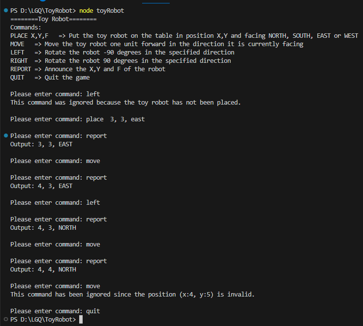
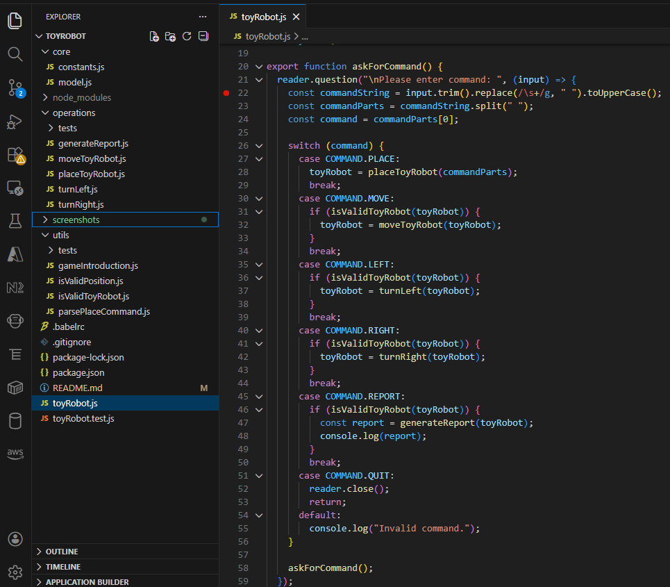

# Toy Robot by GREG LUO

greg.luo@outlook.com, 0424376962

## Code Repo

Github repo: https://github.com/GregLuoDev/ToyRobot

## Technical choices

- Node.js (javascript), Jest

## Steps to run locally

- Ensure Node.js is installed on your machine
- run command: node toyRobot

## Run test cases

- run command: npm test

## File structure

